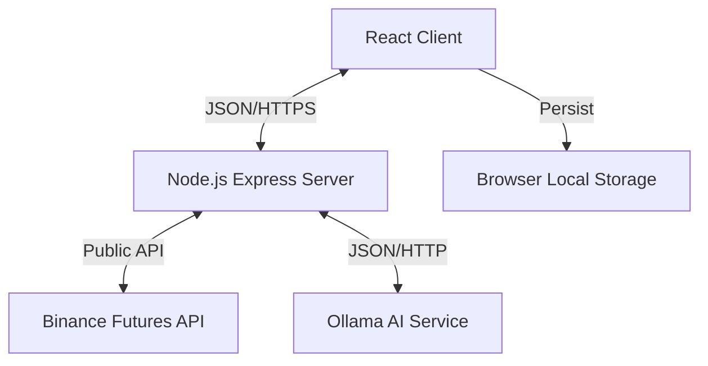

# System Design Document

**Status:** Approved
**Version:** 1.1.0
**Date:** 2026-01-13

---

## 1. Architecture Overview
The system adopts a **Backend-for-Frontend (BFF)** architecture to address security and performance issues.

### High-Level Diagram


### Components
1.  **Frontend (Client)**:
    *   **Tech**: React 19, Vite, TailwindCSS, GSAP (Animations).
    *   **Responsibility**: UI rendering, state management, local storage persistence, requesting scans.
    *   **Design**: Glassmorphism, Modern Dark UI.
    *   **New Feature**: "Offline" mode using cached data from `localStorage`.

2.  **Backend (Server)**:
    *   **Tech**: Node.js, Express.
    *   **Responsibility**:
        *   **Proxy**: Forwards requests to Binance to hide IP/Origin issues.
        *   **Compute Engine**: Calculates Technical Indicators (SMA, RSI, MACD) to offload the client.
        *   **Security Boundary**: Holds `OLLAMA_API_KEY` (if needed) and manages rate limits.
        *   **Caching**: In-memory cache (Node-Cache) for Binance market data (TTL: 60s).

---

## 2. Data Model

### 2.1 API Interfaces (Backend <-> Client)

**Endpoint: `GET /api/scan`**
*   **Description**: Triggers a full market scan.
*   **Response**:
    ```json
    {
      "timestamp": "2026-01-13T10:00:00Z",
      "marketSummary": {
        "bullishCount": 120,
        "bearishCount": 45,
        "neutralCount": 335
      },
      "signals": [
        {
          "symbol": "BTCUSDT",
          "rank": "A+",
          "signal": "STRONG_BUY",
          "ltf": "BUY",
          "htf": "BUY",
          "indicators": { "rsi": 45, "macd": "bullish" }
        }
      ]
    }
    ```

**Endpoint: `POST /api/ai-insight`**
*   **Input**: Market Summary JSON.
*   **Response**: `{ "analysis": "Market is currently..." }`

### 2.2 Local Storage Schema
The frontend will store the latest result in `localStorage` under key `crypto-analyst-v1`.

```typescript
interface CachedScan {
  version: number; // For migration safety
  timestamp: number; // Unix epoch
  data: {
    signals: RankedSignal[];
    marketSummary: MarketSummary;
    aiAnalysis: string | null;
  }
}
```

---

## 3. Key Flows

### 3.1 App Initialization (Hydration)
1.  **User** opens the app.
2.  **App** checks `localStorage.getItem('crypto-analyst-v1')`.
3.  **If exists**: Parse JSON.
    *   Update State: `signals = cached.data.signals`
    *   Update UI: Show "Last updated: [Time ago]"
4.  **If empty**: Show "No recent scans. Start a scan to begin."

### 3.2 Scanning Process
1.  **User** clicks "Scan Market".
2.  **UI** shows loading spinner, clears old errors.
3.  **Client** calls `GET /api/scan`.
4.  **Server**:
    *   Fetches 24hr ticker from Binance (filter for top volume/volatility).
    *   Fetches Kline data for relevant pairs (batched).
    *   Calculates Indicators (SMA, RSI, MACD).
    *   Applies Ranking Logic (A+, A, B+).
    *   Returns `RankedSignal[]`.
5.  **Client**:
    *   Receives data.
    *   Calls `POST /api/ai-insight` for text summary.
    *   **Persist**: Saves bundle to `localStorage`.
    *   **Render**: Updates list view with GSAP stagger.

---

## 4. Security & Configuration
*   **Environment Variables**:
    *   `OLLAMA_HOST`: AI Service URL.
    *   `OLLAMA_MODEL`: AI Model Name.
    *   `OLLAMA_API_KEY`: Optional API Key for external providers.
    *   `PORT`: Server port (default 3000).
*   **Rate Limiting**:
    *   Server-side limiter to prevent abuse.
    *   Binance API weight management.

---

## 5. UI/UX Specifications (Phase 4)

### 5.1 Visual Language (Glassmorphism)
*   **Color Palette**:
    *   **Background**: `#0f172a` (Deep Slate) to `#1e293b` (Slate 800) gradient.
    *   **Glass Surface**: `rgba(30, 41, 59, 0.7)` with backdrop-filter blur(10px).
    *   **Primary Accent**: `#3b82f6` (Blue 500) for actions.
    *   **Signal Colors**:
        *   **Buy**: `#10b981` (Emerald 500) - Neon Glow.
        *   **Sell**: `#ef4444` (Red 500) - Neon Glow.
        *   **Neutral**: `#64748b` (Slate 500).
*   **Typography**:
    *   Headings: `Inter`, Bold, tracking-tight.
    *   Data/Code: `JetBrains Mono` or `Roboto Mono`.

### 5.2 Interactions & Animations (GSAP)
*   **Entrance**:
    *   **Staggered List**: Signal rows/cards slide in from bottom with opacity fade (0.05s delay between items).
    *   **AI Insight**: Typewriter effect for the analysis text.
*   **State Changes**:
    *   **Scanning**: Progress bar with pulse effect.
    *   **Hover**: Cards lift (`scale(1.02)`) and glow intensity increases.
*   **Accessibility**:
    *   `prefers-reduced-motion` check to disable GSAP animations.
    *   High contrast text compliance.

### 5.3 Component Structure
1.  **DashboardLayout**:
    *   Sidebar (Desktop) / Bottom Nav (Mobile).
    *   Main Content Area (Glass container).
2.  **MarketStatusHeader**:
    *   AI Analysis summary.
    *   Global market sentiment gauge.
3.  **SignalGrid**:
    *   Responsive Grid (1 col mobile, 2 col tablet, 3 col desktop).
    *   Virtual scrolling if > 50 items.
4.  **SignalCard**:
    *   Symbol Ticker.
    *   Rank Badge (A+ with shimmer effect).
    *   Price & 24h Change.
    *   Mini Chart (Sparkline - optional future).

---

## 6. Acceptance Criteria
1.  **Persistence**: Refreshing the page immediately restores the last scan results.
2.  **Security**: Inspecting Network tab shows calls to `localhost:3000`, not Binance/Ollama directly.
3.  **Performance**: Animations do not cause frame drops (< 16ms frame time).
4.  **Aesthetics**: Glassmorphism effect is visible (blur + translucency) and readable.
